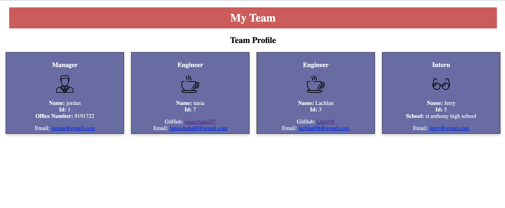

# Team-Profile-Generator

# Description

This project builds a Node.js command-line application that takes in information about employees on a software engineering team and then generates a HTML webpage that displays summaries for each person. The user can select team members for the team including manager, engineers and interns. They are prompted to answer some questions for each type of team member they select from the list of options. When they are done selecting all the team members for their team then a HTML page is generated that creates a team profile with all the information for each team member.

# Installation

Clone the Team-Profile-Generator repository to your local machine. The libs folder contains the classes, the dist folder contains the rendered HTML file and css file. The tests folder contain the tests for the classes and the index.js file is in the Team-Profile-Generator folder. To run the application the user needs to run the command 'node index.js' in the termainal.

# Screenshot 
The following screenshot demonstrates the application functionality:

# Link to deployed application

Walk-through video link : https://drive.google.com/file/d/1_N1r6Oe8V0m4ha8VTDTsX4cepMwGrmfV/view
